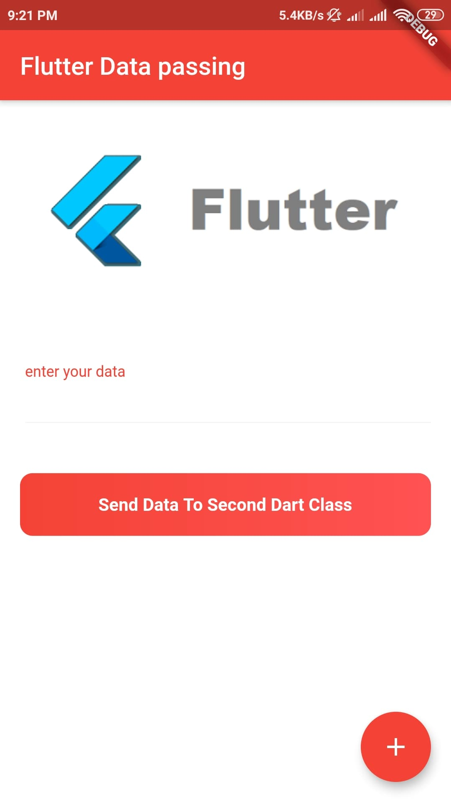
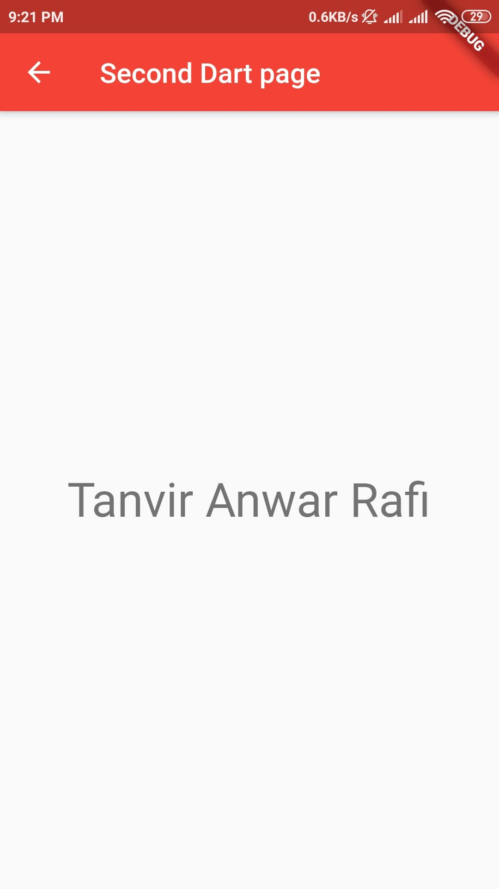

# Data passing Flutter

This project is for learning how to pass data from one page to another in Flutter App.

### - Data Passing
 
## Screenshots
 &nbsp;&nbsp;&nbsp;&nbsp;&nbsp;&nbsp;&nbsp;&nbsp;&nbsp;&nbsp; 
